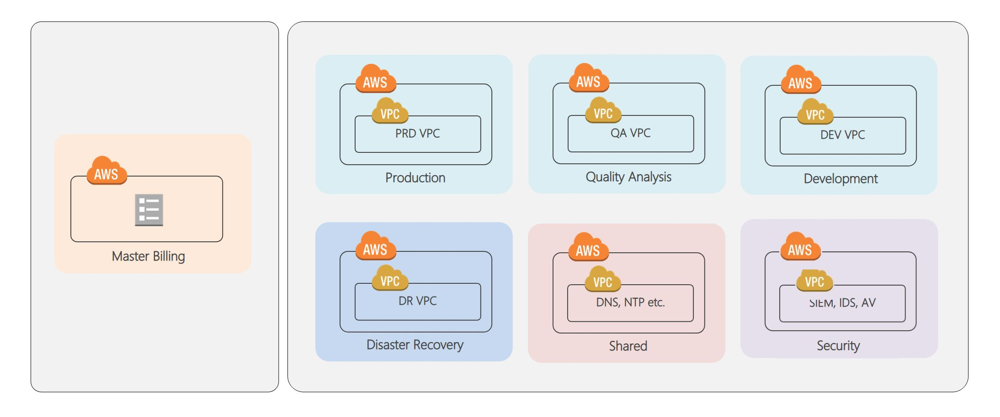
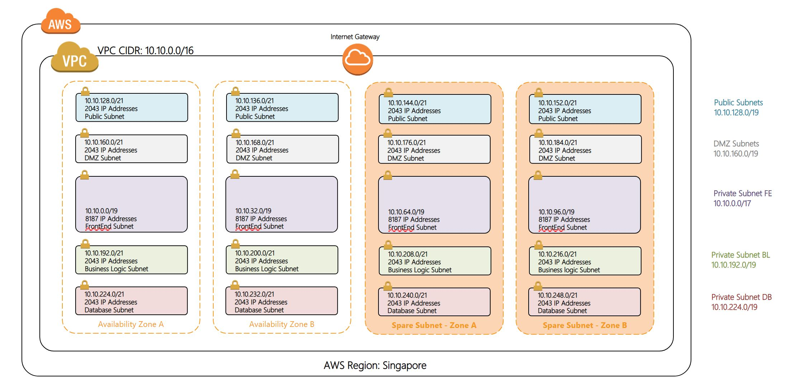
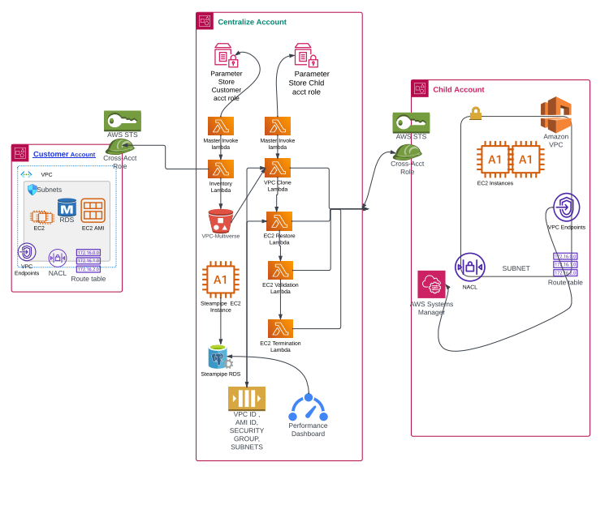
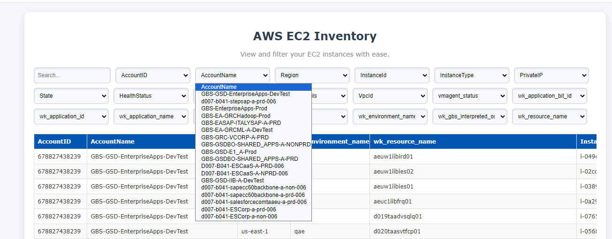

## About Me
# Raj DevOps - Multi-Cloud Architect

With a decade of experience in IT, I am a Multi-Cloud Architect with a deep expertise in various cloud platforms and DevOps practices. My proficiency enables me to design and implement robust and scalable solutions tailored to modern needs. I specialize in crafting sophisticated cloud architectures and modernizing applications. My skill set includes:

#### Technical Skills:
 - **Amazon Web Services(AWS)**
 - **Microsoft Azure**
 - **Terraform**
 - **Amazon Web Services(AWS)**
 - **Cloud Migration**
 - **Cloud Security**
 - **Cloud Cost Optimization**
 - **Azure Devops/Jenkins(CI-CD)**
 - **Python Automation**

For any inquiries or collaborations, please contact me at www.linkedin.com/in/raj-deolekar

### Projects

1. Onpremise to Cloud Migration (Lift & Shift Approach) >> Later Scope modified to (Application Assessment)
  Migrated customer 70+ applications around 400+ (Windows/Linux servers) to AWS cloud using AWS Server migration services.

    - Landing zone overview
      
  
    - Account structure
      
  
    - IP Subnets & Availablity zones
       
       

2. Customized AWS Backup Validation Solution
  Developed an automated solution using AWS Lambda and CloudFormation, enabling single-click deployment across 100+ accounts. Achieved a significant reduction in manual validation time and accuracy in DR-Drill.

    - AWS Backup Validation Solution
      
          

2. Internal Mutli-Cloud Inventory
  Created an internal website for cloud inventory management across AWS and Azure, providing real-time infrastructure insights accessible to both technical and non-technical users.
  With further PowerAutomate we can added real-time inventory fetching feature and downloading customized inventoryy based on various filters/tags.

  - **This reduced devops team to logging each account and fetech inventory or get status of VMs**
  - **Allow app teams to see and fetech current Inventory without devop team involvement**
  - **This solutions was developed due to recent Microsoft Outage**

    - Internal Mutli-Cloud Inventory
      
  
 
