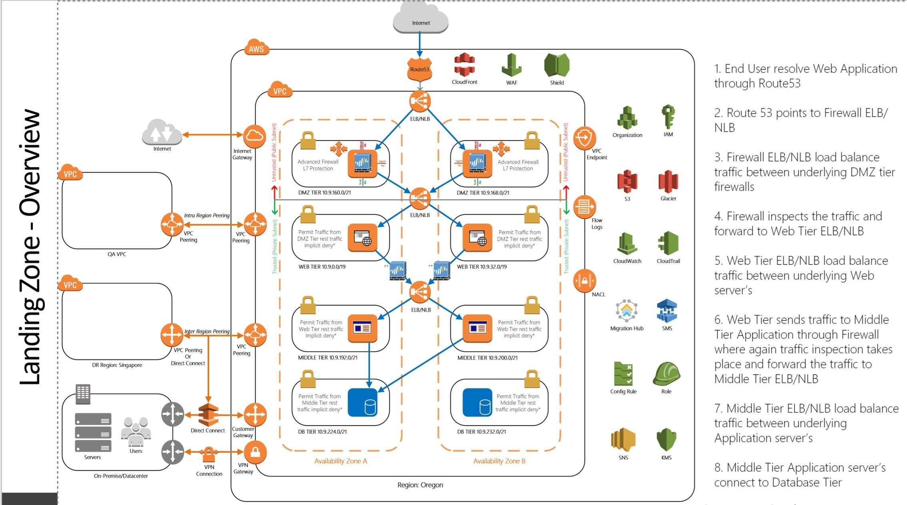
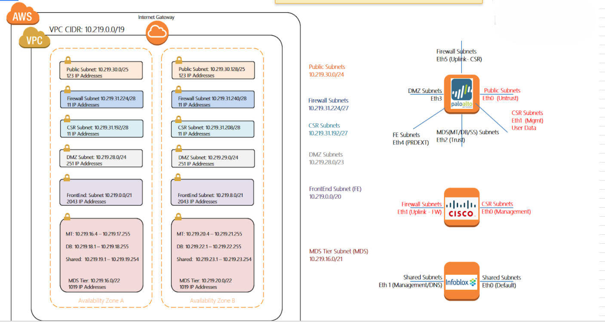
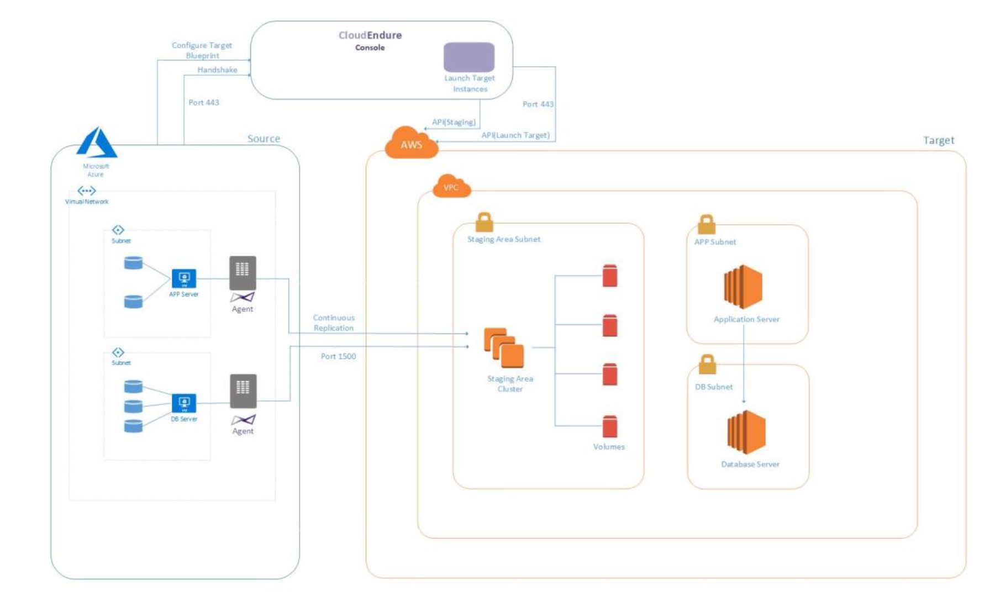
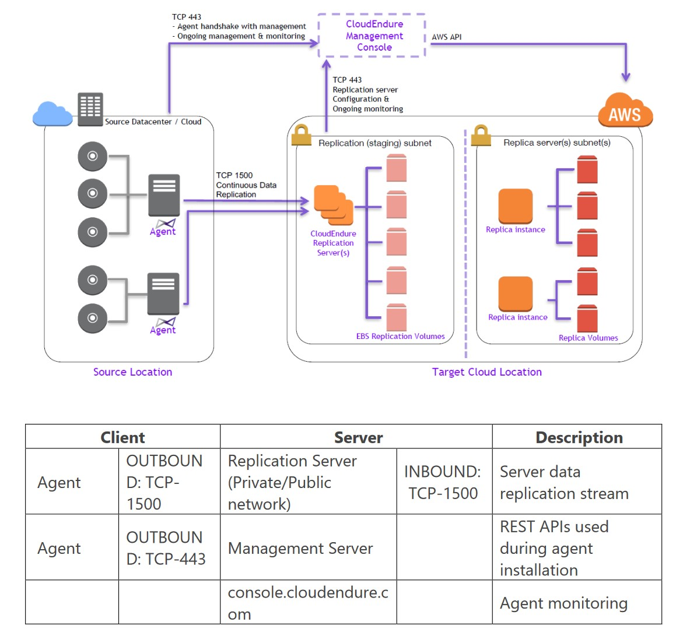

## About Me
# Raj DevOps - Multi-Cloud Architect

  With a decade of experience in IT, I am a Multi-Cloud Architect with a deep expertise in various cloud platforms and DevOps practices. My proficiency enables me to design and implement robust and scalable   
  solutions tailored to modern needs. I specialize in crafting sophisticated cloud architectures and modernizing applications. My skill set includes:

#### Technical Skills:
 - **Amazon Web Services(AWS)**
 - **Microsoft Azure**
 - **Terraform**
 - **Cloud Migration**
 - **Cloud Security**
 - **Cloud Cost Optimization**
 - **Azure Devops/Jenkins(CI-CD)**
 - **Python Automation**

 For any inquiries or collaborations, please contact me at www.linkedin.com/in/raj-deolekar

### Projects

1. Onpremise to Cloud Migration (Lift & Shift Approach) >> Later Scope modified to (Application Assessment)

    Migrated customer 70+ applications around 400+ (Windows/Linux servers) to AWS cloud using AWS Server migration services.

   - Architecture overview
        
      
   - Account structure
      
      
   - IP Subnets & Availablity zones
       

  ---------------------------------------------------------------- **** ----------------------------------------------------------------
       
2. AWS Backup Validation Solution
   
    Developed an Customized AWS Backup Validation Solution which Clone AWS VPC Components and EC2 clone with same attributes (NAME+IP+Subnet+SecurityGroups) using AWS Lambda, SQS, Iam Role and CloudFormation  
    template. Thi solution can be deployed across multi-account/multi-region using CloudFormation stackset feature. With this custtomer achieved a significant reduction in manual   
    validation time and accuracy in DR-Drill.
 
    - Customized AWS Backup Validation Solution
      

  ---------------------------------------------------------------- **** ----------------------------------------------------------------
          

3. Internal Mutli-Cloud Inventory
   
     Created an internal website for cloud inventory management across AWS and Azure, providing real-time infrastructure insights accessible to both technical and non-technical users.
     With further PowerAutomate we can added real-time inventory fetching feature and downloading customized inventoryy based on various filters/tags.
   
     **Benefits**
     - *This reduced devops team to logging each account and fetech inventory or get status of VMs*
     - *Allow app teams to see and fetech current Inventory without devop team involvement*
     - *This solutions was developed due to recent Microsoft Outage*

      
    
  ---------------------------------------------------------------- **** ----------------------------------------------------------------

4. Hybrid Cloud DR Architecture (AWS|Azure)
   
      The purpose of this engagement is to perform assessment with a view to consult, design and
      perform activities which would enable Customer to host Disaster Recovery or Secondary
      datacenter for these application and Database on Amazon AWS.
    
      
    
    
      

      **Steps of AZURE to AWS Failover activity**

      1) Created a Default Project for Failover activity and Installed the CloudEndure Agent on Application(VM ScaleSet) server and on LNT-PRD-DB01 server and it started the replication on CloudEndure console.
      2) Configure the Blueprint for the server’s.
      3) Once the CloudEndure console shows “Continuous Data Replication”, we have started the Failover of servers one by one.
      4) Select the server and click on “Recovery Mode”, Sever is created on AWS with the same configuration mentioned on Blueprint.
      5) X team has tested the server one by one and checked the application and database and changed the DNS pointer to AWS Server.
      6) X team has checked all the servers and pointed the DNS to AWS Sever and shutdown the Azure servers. All the workload of the application got migrated to AWS servers.

  
 
